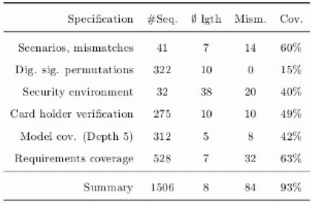

# TextTron-Lightweight-text-detector
 

## 1. Introduction

TextTron is a simple light-weight image processing based text detector in document images. 
TextTron detect text with the help of Contours applied on a preprossed image. This meant for fast text detection without using any machine learning or deep learning model.
Though this will not work well in scene text detection, only meant for document images <br><br>

## 2. Setup
```
$pip install TextTron
```

<b>Code is developed under following library dependencies</b> <br>
OpenCV = 4.1.2 <br>
NumPy = 1.17 <br>


## 3. Usage
### 3.1 API


i. Import the neccessary libraries and read the image
```
import cv2
import TextTron
img = cv2.imread(PATH)
```
ii. Pass the numpy or cv2 image to the TextTron 
```
TT = TextTron(img) 
TT = TextTron(img, low=196,high=255,yThreshold=15,xThreshold=2) # Change this till you get good result
```
iii. Get the text bounding boxes
```
tbbox = TT.textBBox
``` 
 

iv. Get the ploted image (optional)
```
plotImg = TT.plotImg
``` 
v. If you want to set/decide best parameter for your case (optional)
```
TextTron.setParameters(img)
```

